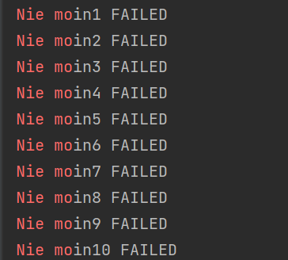

# README

## Wstęp

Cześć! To repozytorium zawiera narzędzie, które pomaga w testowaniu rozwiązania drugiej pracy domowej z AiSD.
Jako że w naszej wersji testowej rozwiązania na UPL-u są tylko 3 testy, dodatkowo nie sprawdzają one nawet wszystkich funkcji,
postanowiłem sam napisać sprawdzarkę, żebyśmy mogli porównać rozwiązania i nawzajem sprawdzić, czy mamy poprawne.

Uwaga: testy mogą nie być na 100% poprawne.
Dlatego, jeżeli uważasz, że masz zrobione dobrze zadanie,
a wyniki wychodzą inne,
proszę o kontakt na PW discord: `MrPatyk#1501` lub messenger: `Patryk Skowron`
i wtedy poprawię testy :)

## Instrukcja obsługi

1. W pliku `solver.py` wpisz swój kod rozwiązujący zadanie.
2. Uruchom plik `sprawdzarka.py`, aby przetestować swój kod.
3. Przy każdym teście napisane jest, czy twój program przeszedł dany test.

## Ewentualne błędy
Napisałem sprawdzarkę, aby dało się odpalić ją zarówno na Linuxie, jak i na Windowsie. Jeżeli jednak Windowsie wyjście ze sprawdzarki wygląda w ten sposób:

to CMD próbuje nam powiedzieć, że nie może znaleźć programu Python, ale nie jest w stanie wyświetlić pełnej informacji, bo dławi się na polskich znakach. Aby to naprawić, trzeba dodać ścieżkę do Pythona do zmiennych środowiskowych. (max 2 minuty)

[Tutaj link z quickfixem.](https://inferiordatascience.com/jak-dodac-pythona-do-path-windows-10/)

## Testy:

- `[1;10)` testy selection sorta n = 5
- `[10;20)` testy bubble sorta n = 5
- `[20;30)` testy bucket sorta n = 5
- `[30;40)` testy merge sorta n = 5 
- `[40;50)` testy quick sorta n = 5
- `[50;60)` różne testy
- `[60;200]` testy z wielkością tablicy 100 każdego sortowania

## Struktura katalogów

- `solver.py` - plik, w którym powinno się umieścić swój kod rozwiązujący zadanie.
- `sprawdzarka.py` - plik, który należy uruchomić w celu przetestowania rozwiązania.
- `in/` - katalog zawierający pliki wejściowe do testów.
- `out/` - katalog zawierający oczekiwane wyniki testów.

